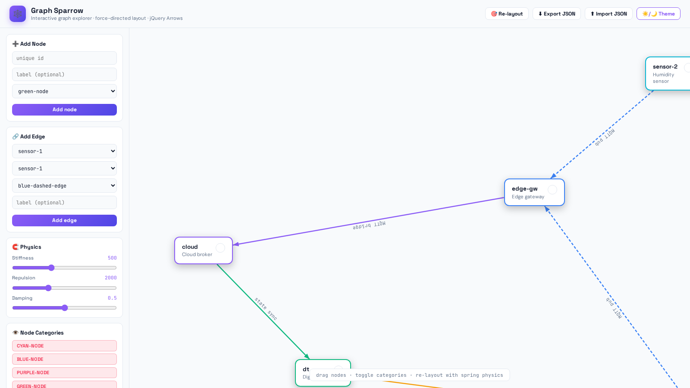
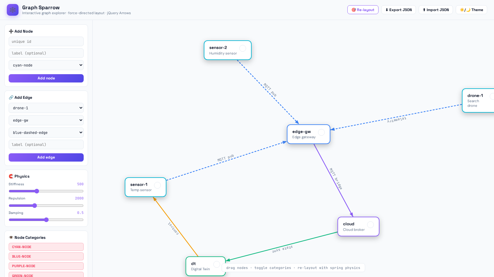

# 🕸️ Graph Sparrow

[](https://github.com/alejp1998/graph-sparrow)
[](LICENSE)
[](https://jquery.com/)

**Interactive graph visualization tool** with built-in **force-directed layout** ([Springy](https://github.com/dhotson/springy)), draggable nodes, category-based hide/show toggles, **JSON graph import/export**, and [jQuery Arrows](https://github.com/alejp1998/jquery-arrows) SVG connectors with live-following geometry.



## Features

- **Force-directed physics** — spring stiffness, repulsion, and damping controls; deterministic synchronous layout ticks
- **Live SVG arrows** — colored, labeled, dashed connectors that follow nodes while dragging (50ms global update loop)
- **Category toggles** — hide/show entire node and edge categories with one click
- **Graph serialization** — export/import graphs as JSON (round-trip safe)
- **Dynamic editing** — add nodes and edges through the sidebar forms with duplicate guards
- **Node lifecycle** — hide/show moves nodes to a hidden pool; removal cascades to incident edges
- **Cockpit UI** — 100vh locked layout, dark/light themes, no page scrollbars



## Quick Start

```bash
# Serve the demo
python3 -m http.server 8078 --directory .
# → http://localhost:8078
```

Or open `index.html` directly in a browser (requires internet for the jQuery CDN).

## Public API

### Nodes

```js
addNode({ id: "sensor-1", category: "cyan-node", text: "Temp sensor" });
removeNode("sensor-1"); // cascades to incident edges
hideNode(window.nodes["sensor-1"]); // moves to hidden pool
showNode(window.nodes["sensor-1"]);
```

### Edges

```js
addEdge({
  srcNodeId: "sensor-1",
  dstNodeId: "edge-gw",
  category: "blue-dashed-edge",
  text: "MQTT pub",
});
removeEdge("sensor-1-edge-gw");
hideEdge(edge); // hides the arrow element
showEdge(edge);
```

### Serialization

```js
const json = exportGraph(); // pretty-printed graph JSON
importGraph(json); // clear + rebuild from JSON
```

### Layout

```js
reloadGraphLayout(); // run force-directed layout (400 synchronous ticks)
```

## Node & Edge Categories

Built-in styles (override in `style.css`):

| Category                                                                             | Visual              |
| ------------------------------------------------------------------------------------ | ------------------- |
| `green-node` / `blue-node` / `red-node` / `cyan-node` / `amber-node` / `purple-node` | Node border colors  |
| `blue-dashed-edge` / `purple-edge` / `orange-edge` / `green-edge` / `rose-edge`      | Arrow stroke styles |

## Architecture

| File                   | Responsibility                                                                                       |
| ---------------------- | ---------------------------------------------------------------------------------------------------- |
| `addnodesedges.js`     | Node/edge lifecycle, category counters, JSON serialization, single global arrow loop                 |
| `hideshownodes.js`     | Hide/show pool logic for nodes and edges                                                             |
| `edgenodetoggles.js`   | Category toggle event delegation                                                                     |
| `reloadgraphlayout.js` | Springy force-directed layout integration                                                            |
| `springy.js`           | Bundled force-directed physics engine                                                                |
| `jquery.arrows.js`     | SVG connector plugin (v2.0, synced from [jquery-arrows](https://github.com/alejp1998/jquery-arrows)) |

## Development

```bash
npm install
npm test             # 13 Node.js unit tests (node --test + jsdom)
npm run lint         # ESLint
npm run format       # Prettier
npm run check        # everything
npm run test:manual  # serve demo on :8078
```

The test suite covers node/edge lifecycle, duplicate guards, visibility toggles, category counters, Springy graph math (incl. finite-position force simulation), and JSON round-trip serialization.

## License

Released under the [MIT license terms](LICENSE).
